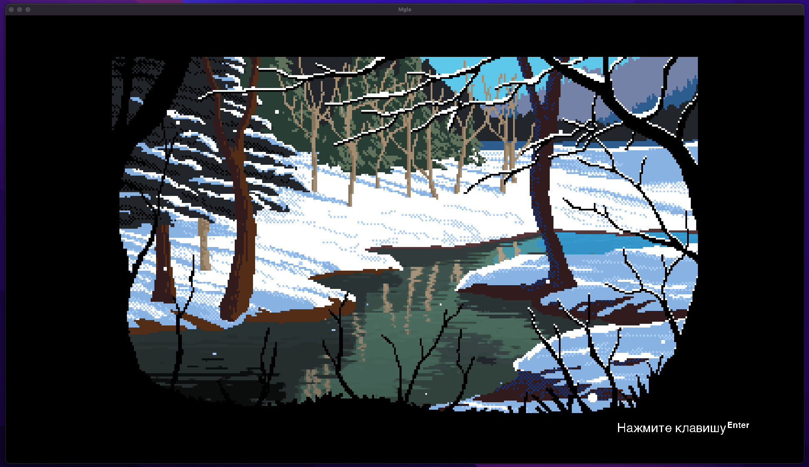
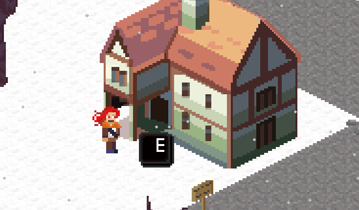
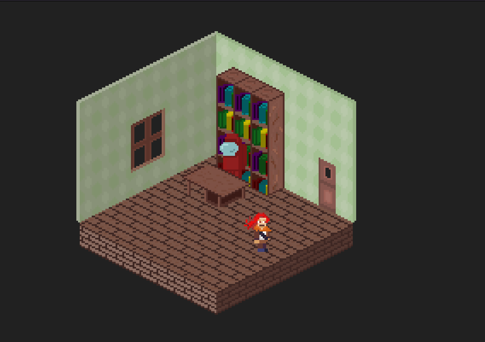
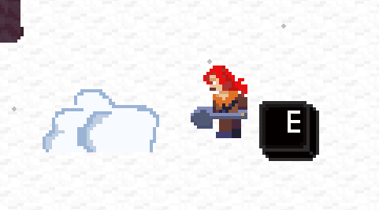
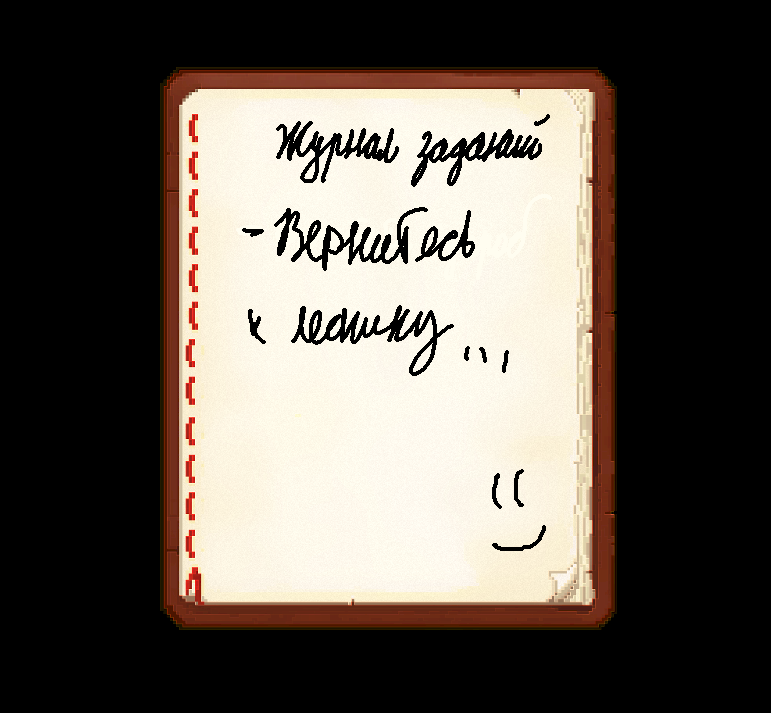

# РПГ Игра - Тайны мглы

 

**Сюжет игры основан на прохождении различных миссий, испытаний и поручений.
Действия игры разворачиваются в одном из городов северной страны.
Несколько лет назад мир накрыла снежная мгла, от которой погибло около 70% населения планеты.
Главному герою игры предстоит выяснить причину изменения мировой мглы, накрывшей всю планету...**
- Графический движок. В игре используется, изометрический алгоритм для выведения объектов на экран, а также отображения дополнительной информации.
- Текстуры и спрайты. Нарисованы разнообразные текстуры и спрайты, для создания атмосферы игры и сюжета.
- Карта. Разработка новых карт будет осуществляться при помощи специального алгоритма, который преобразует, введённую разработчиком информацию, в понятную для движка инструкцию.
- Сюжет. Для разработки сюжета игры выбрана специальная структура кода, при помощи которой, новую миссию можно будет «собрать» за несколько десятков минут.

## Особенности:
**В игре падает случайно генерируемый снег. Просчитываются коллизии и появляются всплывающие подсказки. С некоторыми объектами можно взаимодействовать.**

### Игрок имеет возможность заходить в здания:

 

 

### Взаимодействовать с объектами на карте:

 

### Открывать журнал заданий:

 

